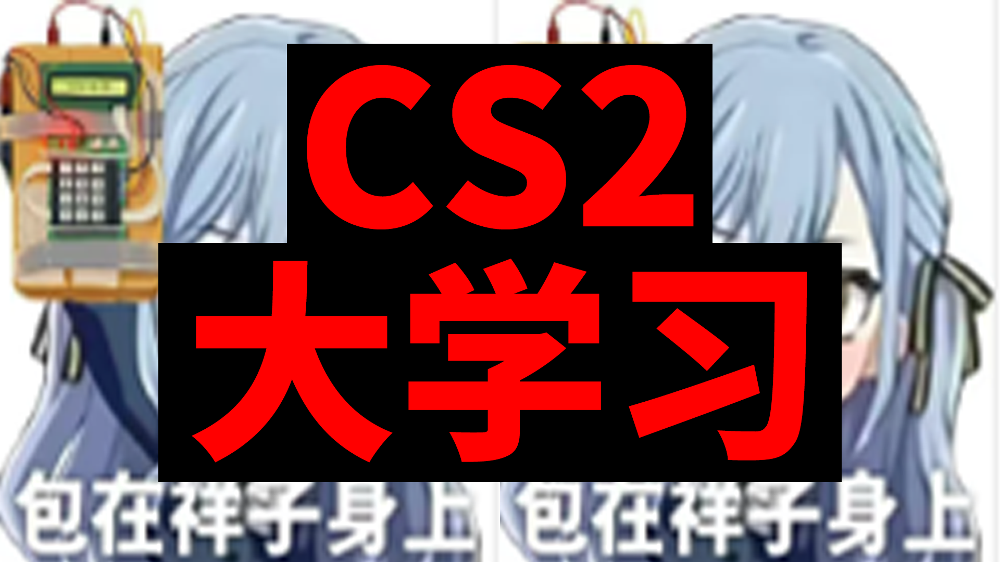

# CS2大学习

欢迎来到 CS2 大学习工具站！这里包含两大模块，帮助你快速掌握团队协作所需的基础：

## 道具描点速查

按左侧选择地图，浏览不同位置的标准道具投掷。每个条目包含：**道具类型**、**阵营**、**落点**、**站位**、**描点**、**操作**、**备注**与**参考图片**，助你迅速找到实战需要的道具。

## 简易战术本

同样按地图分类收录基础战术。

最后更新：<!--LAST_UPDATED-->2025-10-10T12:52:08+02:00<!--END_LAST_UPDATED-->

