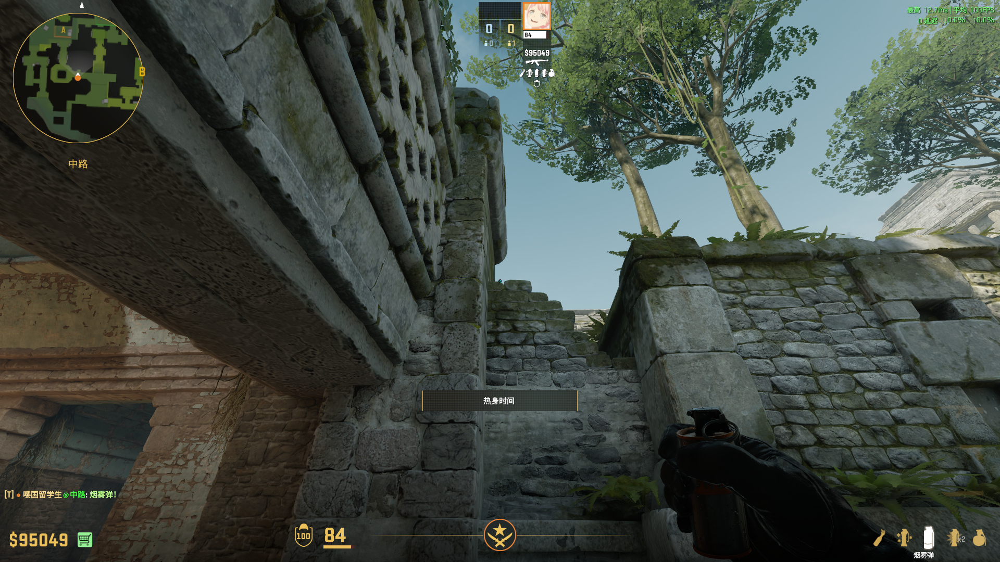

# Ancient

## 匪口 — 快烟
**类型**: 烟雾  ·  **阵营**: CT

**落点**: 匪口里  
**站位**: 出生点  
**描点**:   
**操作**: 走一步跳投  
**备注**: 从上到下是一到五出生点的描点

## 黑屋 — 反清闪
**类型**: 闪光  ·  **阵营**: CT

**落点**:   
**站位**: 黑屋口靠里  
**描点**:   
**操作**: 双键投  
**备注**: 

## vip — 快烟
**类型**: 烟雾  ·  **阵营**: T

**落点**:   
**站位**: 出生点 
**描点**:   
**操作**: W跳投  
**备注**: 从上到下是一、三、四出生点的描点

## vip — 慢烟
**类型**: 烟雾  ·  **阵营**: T

**落点**:   
**站位**: 石柱左下角  
**描点**:   
**操作**: 跳投  
**备注**: 

## A — CT烟
**类型**: 烟雾  ·  **阵营**: T

**落点**:   
**站位**: A外台下角落  
**描点**:   
**操作**: 跳投  
**备注**: 

## A — CT烟
**类型**: 烟雾  ·  **阵营**: T

**落点**:   
**站位**: 甜甜圈外角落  
**描点**:   
**操作**: 左键投  
**备注**: 

## A — 进点闪
**类型**: 闪光  ·  **阵营**: T

**落点**:   
**站位**: A厅柱子角落  
**描点**:   
**操作**: 左键投  
**备注**: 

## B — 黑屋自助闪
**类型**: 闪光  ·  **阵营**: T

**落点**:   
**站位**:  
**描点**:   
**操作**: 双键投  
**备注**: 

