# Dust 2

## A大 — 拖延烟
**类型**: 烟雾  ·  **阵营**: CT

**落点**: A大中间  
**站位**: 对齐L位边缘  
**描点**: 对齐卫星锅下方角落  
**操作**: 左键投  
**备注**: 

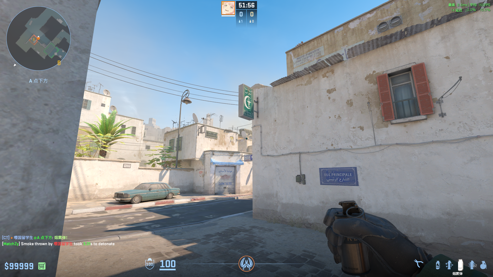

## A大 — 蓝车自助闪
**类型**: 闪光  ·  **阵营**: CT

**落点**: 雨棚架子上  
**站位**: 蓝车角落  
**描点**:   
**操作**: 左键投  
**备注**: 

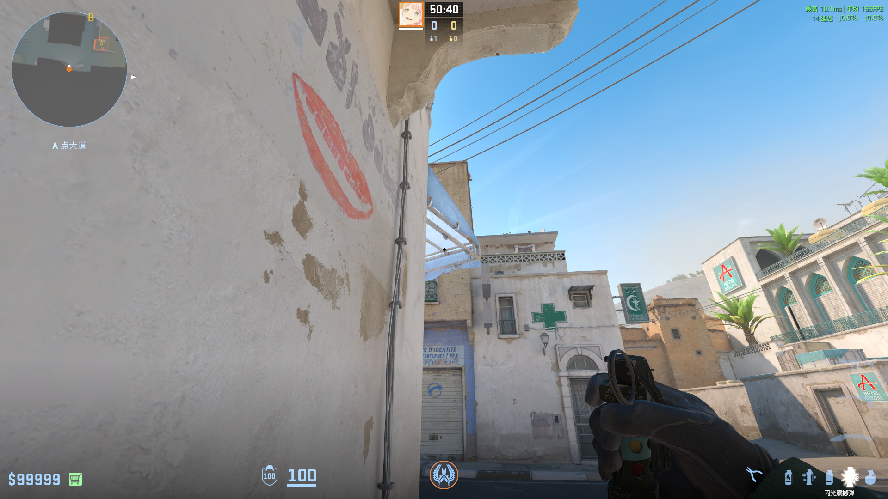

## A大 — 医院闪
**类型**: 闪光  ·  **阵营**: CT

**落点**:   
**站位**:   
**描点**: 医院标牌上方中间  
**操作**: 左键投  
**备注**: 1:49出手

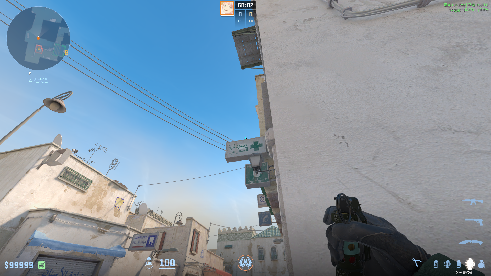

## 中口 — 满封烟
**类型**: 烟雾  ·  **阵营**: T

**落点**: 中门里  
**站位**:   
**描点**: 对齐远处房屋右上角  
**操作**: 跳投  
**备注**: 

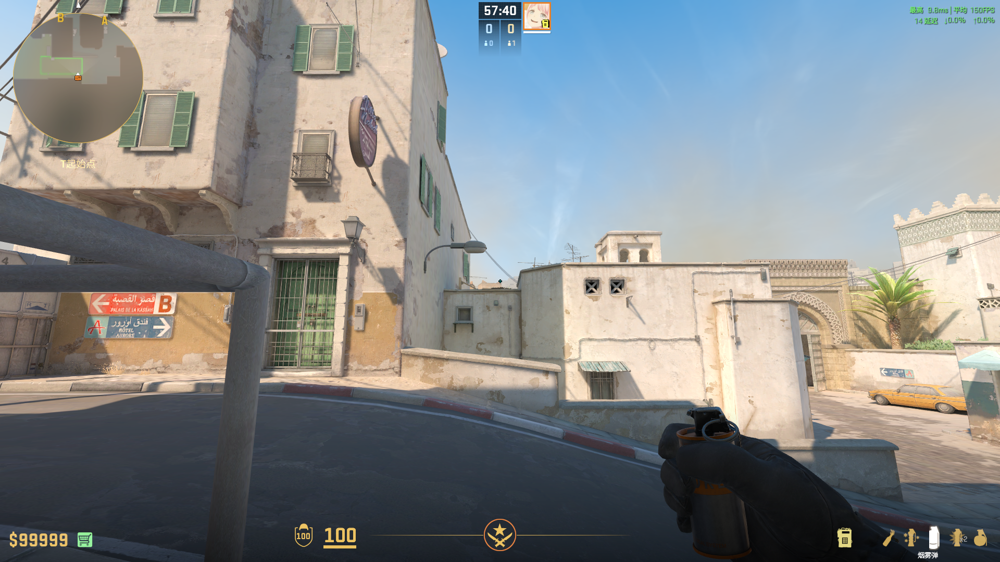

## 中路 — CT烟
**类型**: 烟雾  ·  **阵营**: T

**落点**: CT箱子上  
**站位**:   
**描点**: 对齐钉子右侧模板边缘  
**操作**: 蹲下跳投  
**备注**: 

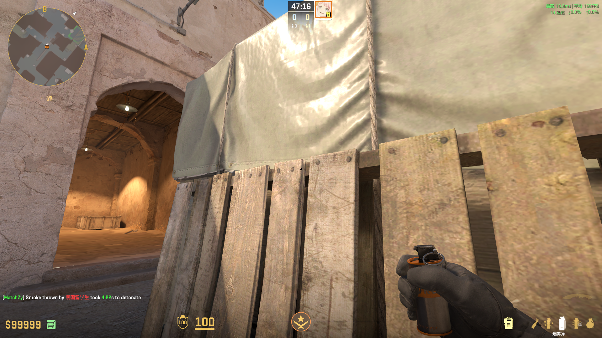

## 中路 — 沙地闪
**类型**: 闪光  ·  **阵营**: T

**落点**: 中门上方  
**站位**:   
**描点**: 对齐杆子延长线一点  
**操作**: 双键投  
**备注**: 

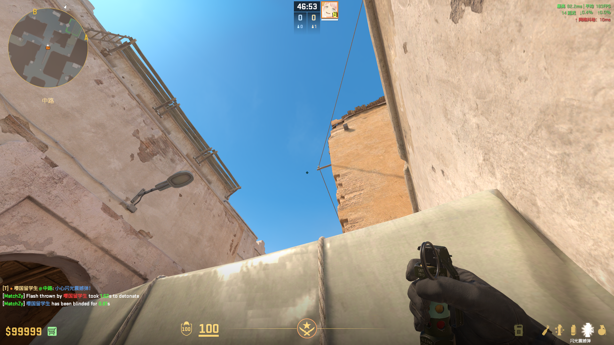

## A小 — 瞬爆闪
**类型**: 闪光  ·  **阵营**: T

**落点**:   
**站位**: B1口右墙  
**描点**: 对齐屋顶边缘  
**操作**: 左键投  
**备注**: 

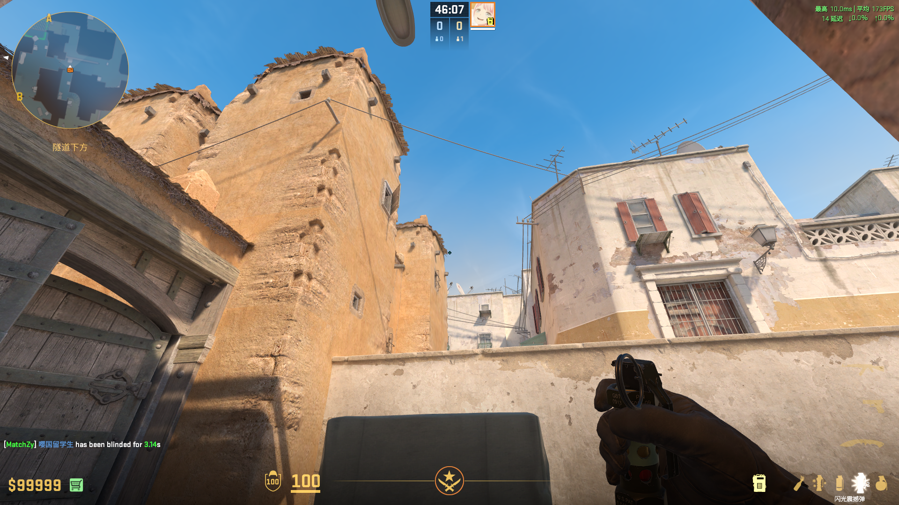

## A小 — 近点火
**类型**: 火  ·  **阵营**: T

**落点**:   
**站位**: A小凹槽角落  
**描点**: 对齐窗下方污渍右端  
**操作**: 跑到准星经过雨棚上方时跳投  
**备注**: 

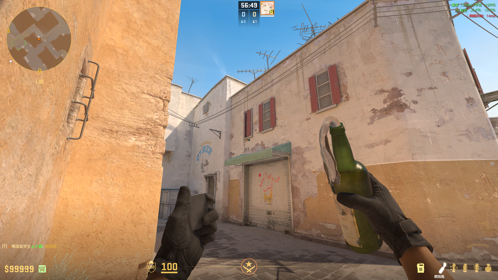

## A大 — 进攻闪
**类型**: 闪光  ·  **阵营**: T

**落点**:   
**站位**: 油桶上  
**描点**: 对齐铁扣右上角  
**操作**: 跳投  
**备注**: 

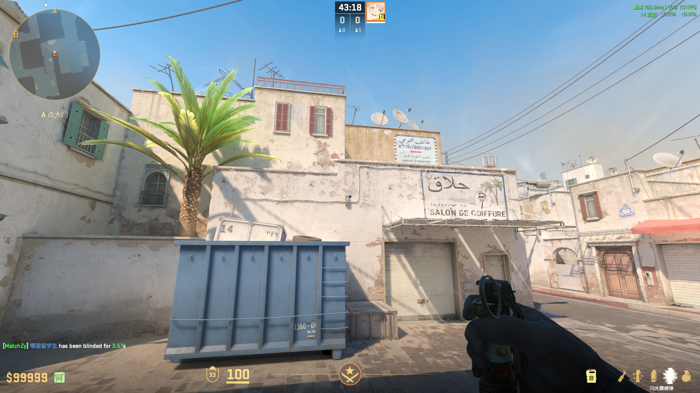

## A大 — 蓝车火
**类型**: 火  ·  **阵营**: T

**落点**:   
**站位**: 同上  
**描点**: 对齐铁箱上方中间  
**操作**: 跳投  
**备注**: 烧不到车后

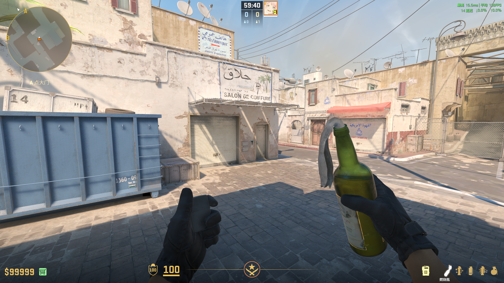

## A大 — CT烟
**类型**: 烟雾  ·  **阵营**: T

**落点**:   
**站位**: 油桶角落  
**描点**: 对齐阴影顶端  
**操作**: 跑一步跳投  
**备注**: 

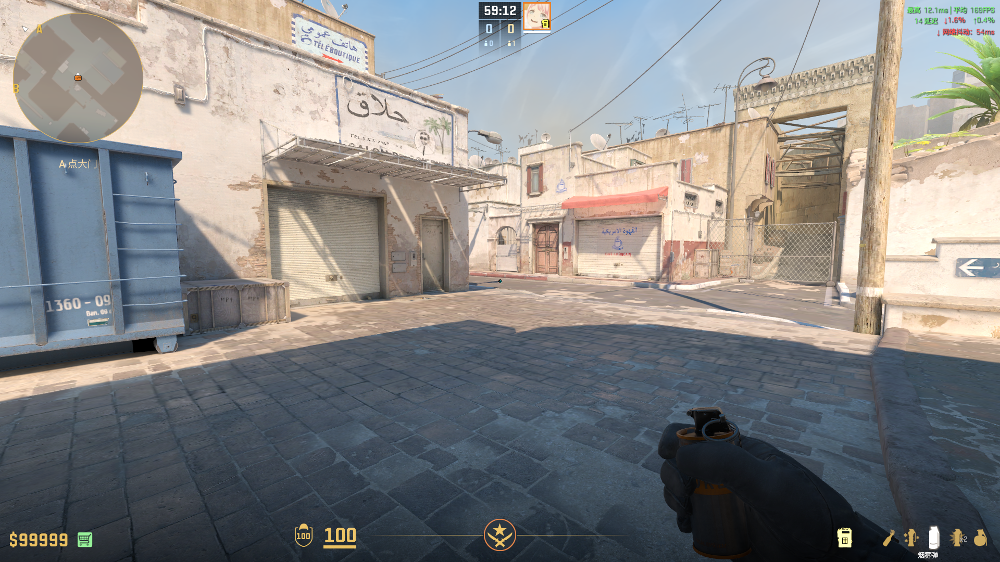

## A大 — 包点火
**类型**: 火  ·  **阵营**: T

**落点**:   
**站位**: 台阶上贴墙对齐白墙边缘  
**描点**: 对齐白色污渍上部中间  
**操作**: 跑一小步跳投  
**备注**: 

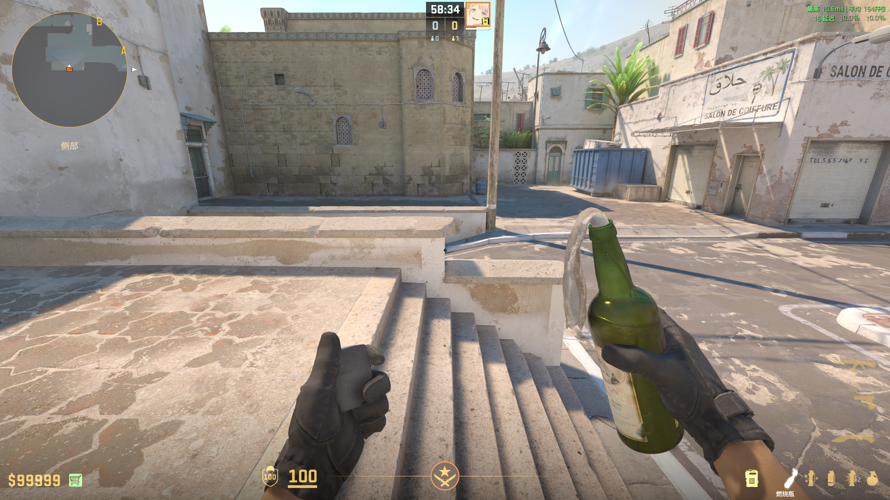
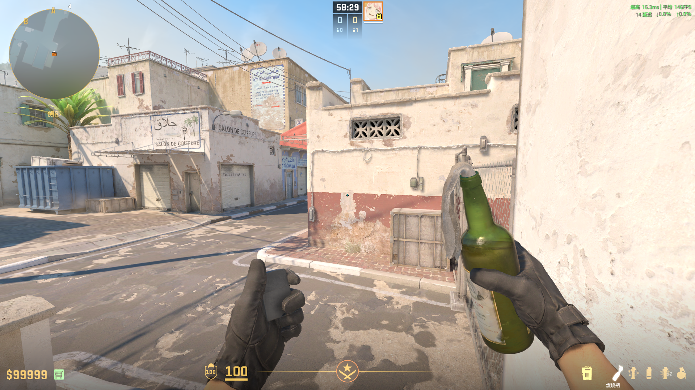

## B — 高闪
**类型**: 闪光  ·  **阵营**: T

**落点**:   
**站位**: 进B1右边角落  
**描点**:   
**操作**: 跳投  
**备注**: 

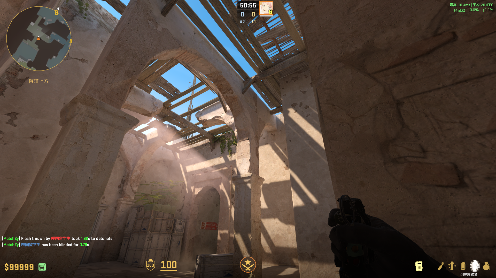

## B — 近点闪
**类型**: 闪光  ·  **阵营**: T

**落点**:   
**站位**: 箱子后方  
**描点**: 对齐墙上污渍  
**操作**: 左键投  
**备注**: 

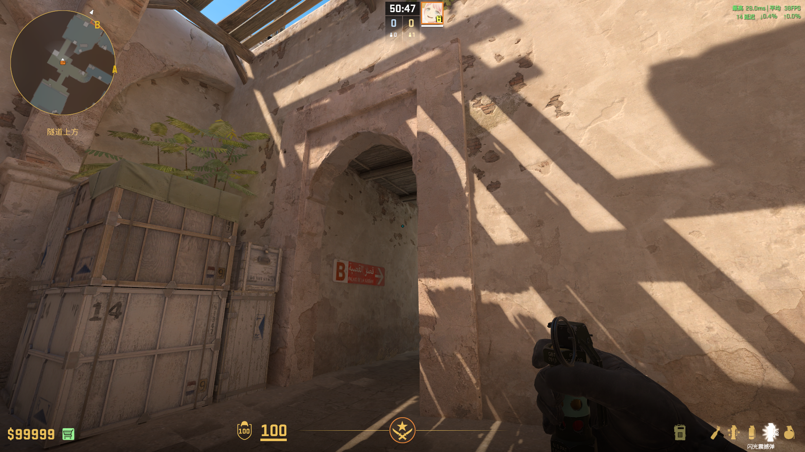

## B — B门烟
**类型**: 烟雾  ·  **阵营**: T

**落点**:   
**站位**: 大箱后  
**描点**: 对齐屋顶木架左侧角落  
**操作**: 左键投  
**备注**: 

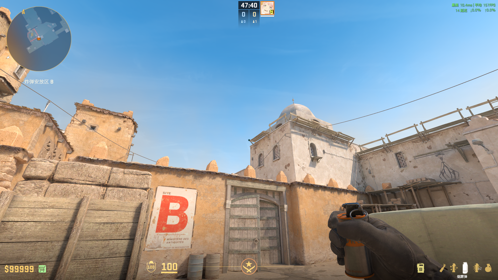
