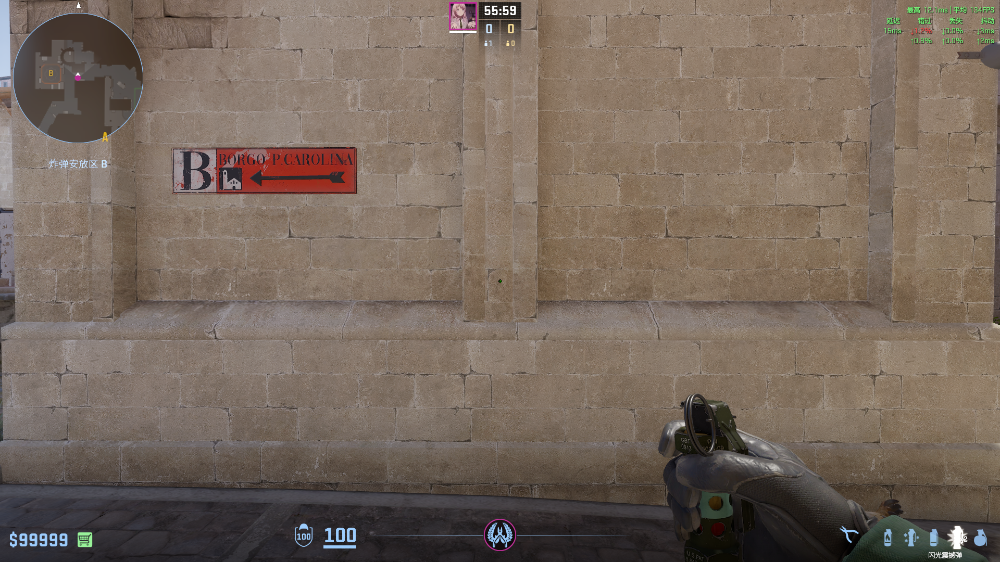
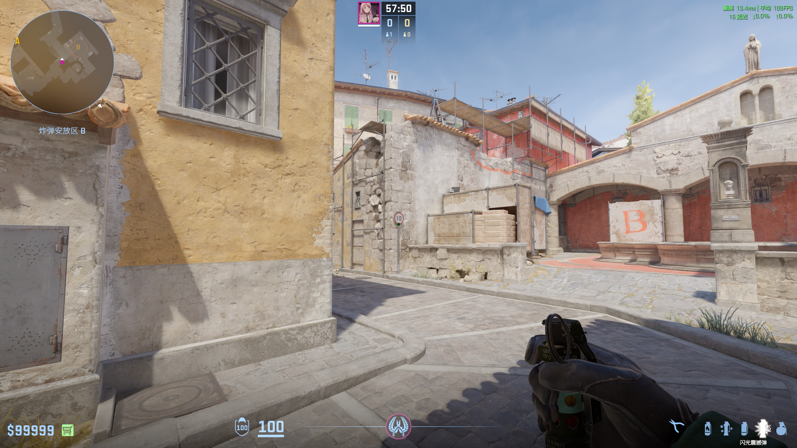
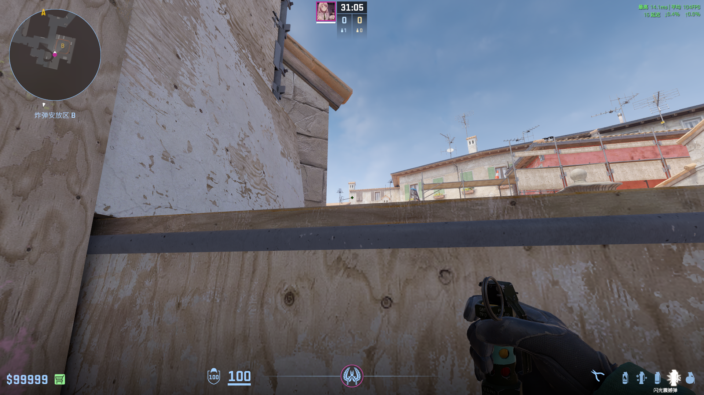
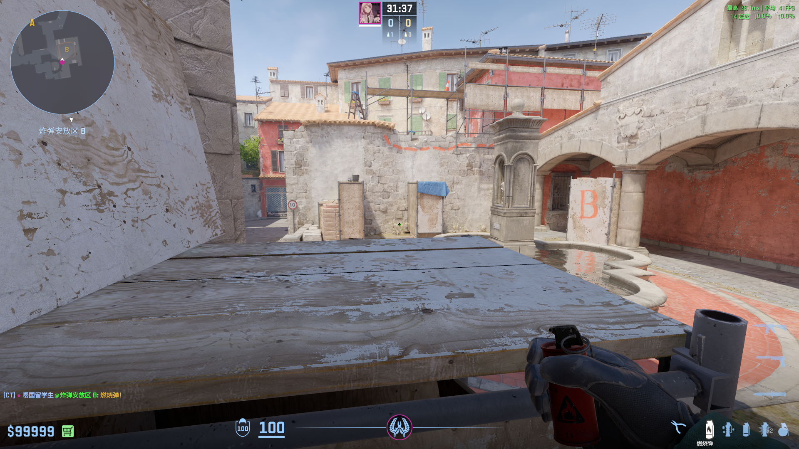
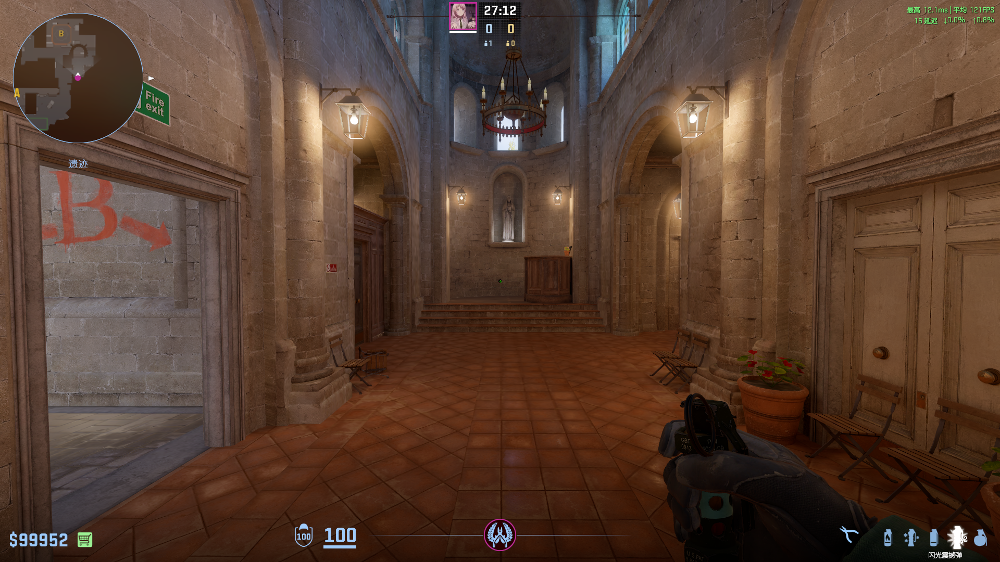
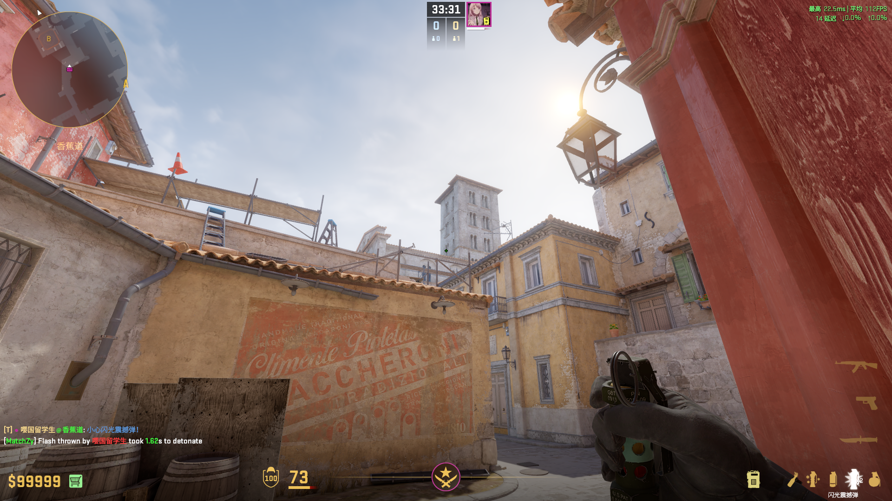

# Inferno

## B — 一二箱两烧火
**类型**: 火  ·  **阵营**: CT

**落点**: 二箱上  
**站位**: 教堂外角落  
**描点**: 对齐灯架与屋顶交点  
**操作**: 跑一步投  
**备注**: 

## 香蕉道 — 抢香蕉道闪
**类型**: 闪光  ·  **阵营**: CT

**落点**:   
**站位**: 教堂外墙中间  
**描点**: 对齐限速牌下端  
**操作**: 跳投  
**备注**: 

## B — 台下反刷闪
**类型**: 闪光  ·  **阵营**: CT

**落点**:   
**站位**: ct长廊角落  
**描点**: 对齐教堂外侧屋檐中间  
**操作**: 左键投  
**备注**: 

## B — B外反清闪
**类型**: 闪光  ·  **阵营**: CT

**落点**:   
**站位**: 棺材角落  
**描点**: 蹲下对齐天线末端  
**操作**: 左键投  
**备注**: 配合石板火使用

## B — 石板火
**类型**: 火  ·  **阵营**: CT

**落点**:   
**站位**: 同上  
**描点**: 对齐一箱中草顶部  
**操作**: 跳投  
**备注**: 

## 教堂 — 棺材回防闪
**类型**: 闪光  ·  **阵营**: CT

**落点**:   
**站位**: 教堂角落  
**描点**: 对齐雕像左边缘下方离地两层砖处  
**操作**: 跳投  
**备注**: 

## 侧道 — vip火
**类型**: 火  ·  **阵营**: T

**落点**: vip里  
**站位**:   
**描点**: 对齐红门右框下延长线与亮处交点  
**操作**: 跑过桥跳投  
**备注**: 提前打碎窗户

## 侧道 — walker烟
**类型**: 烟雾  ·  **阵营**: T

**落点**:   
**站位**:   
**描点**: 对齐窗框右上角  
**操作**: 跳投  
**备注**: 

## 香蕉道 — ct花坛烟
**类型**: 烟雾  ·  **阵营**: T

**落点**: 花坛上  
**站位**: 木桶前的角落  
**描点**:   
**操作**: 左键投  
**备注**: 

## 香蕉道 — ct花坛烟
**类型**: 烟雾  ·  **阵营**: T

**落点**: 花坛上  
**站位**: 石板后角落  
**描点**:   
**操作**: 双键跳投  
**备注**: 

## 香蕉道 — ct花坛闪
**类型**: 烟雾  ·  **阵营**: T

**落点**:   
**站位**: 石板前角落  
**描点**: 对齐黑条中间左边缘  
**操作**: 左键投  
**备注**: 

