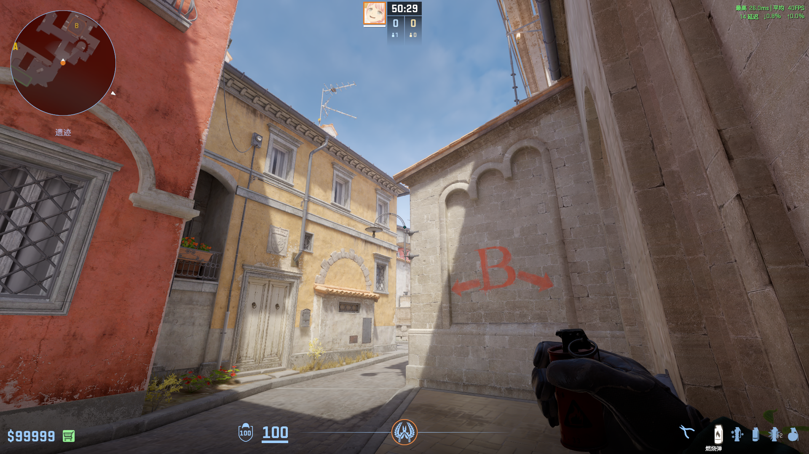
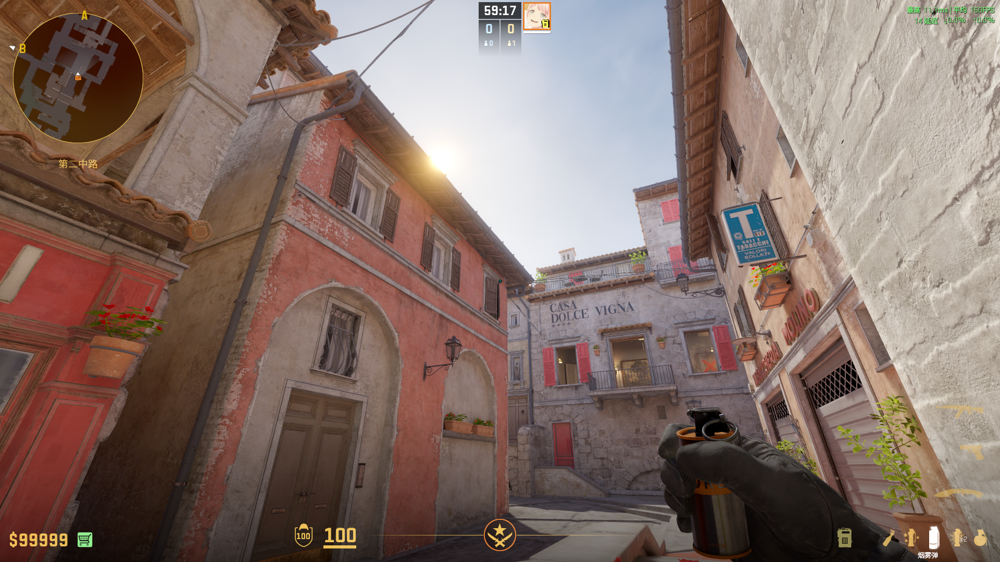
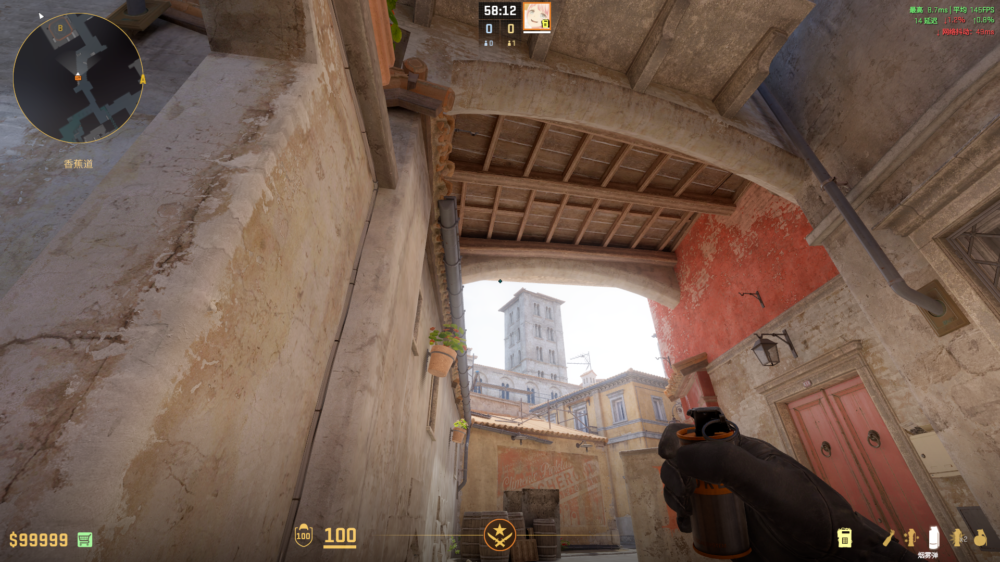

# Inferno

## B — 一二箱两烧火
**类型**: 火  ·  **阵营**: CT

**落点**: 二箱上  
**站位**: 教堂外角落  
**描点**: 对齐灯架与屋顶交点  
**操作**: 跑一步投  
**备注**: 

## 侧道 — vip火
**类型**: 火  ·  **阵营**: T

**落点**: vip里  
**站位**:   
**描点**: 对齐红门右框下延长线与亮处交点  
**操作**: 跑过桥跳投  
**备注**: 提前打碎窗户

## 侧道 — walker烟
**类型**: 烟雾  ·  **阵营**: T

**落点**:   
**站位**:   
**描点**: 对齐窗框右上角  
**操作**: 跳投  
**备注**: 

## 香蕉道 — ct花坛烟
**类型**: 烟雾  ·  **阵营**: T

**落点**: 花坛上  
**站位**:   
**描点**:   
**操作**: 左键投  
**备注**: 

## 香蕉道 — ct花坛烟
**类型**: 烟雾  ·  **阵营**: T

**落点**: 花坛上  
**站位**: 石板后角落  
**描点**:   
**操作**: 双键跳投  
**备注**: 

