# Mirage

## 中路 — vip慢烟
**类型**: 烟雾  ·  **阵营**: T

**落点**: vip  
**站位**: 垃圾桶前  
**描点**: 对齐栏杆角落  
**操作**: 按D移动时跳投  
**备注**: 

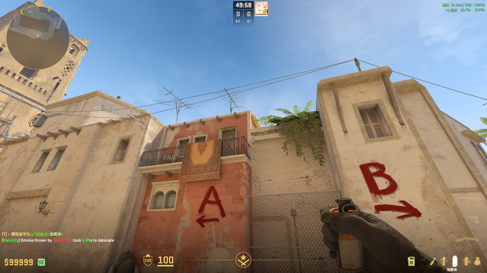

## 中路 — vip慢烟
**类型**: 烟雾  ·  **阵营**: T

**落点**: vip  
**站位**: 匪家左后方角落  
**描点**:   
**操作**: W跳投  
**备注**: 

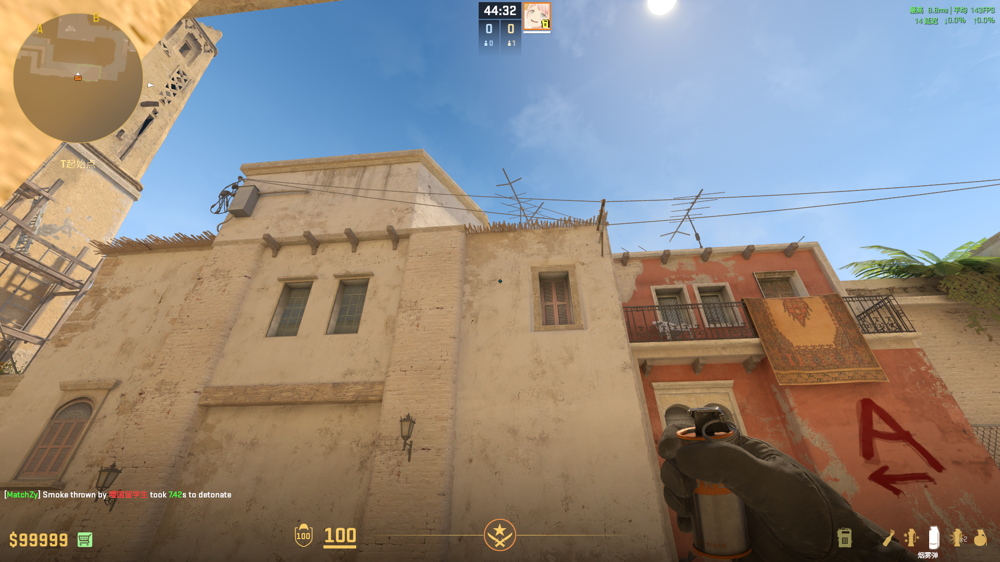

## 中路 — 拱门烟
**类型**: 烟雾  ·  **阵营**: T

**落点**: 拱门下方中间  
**站位**: 垃圾桶左侧  
**描点**:   
**操作**: 跳投  
**备注**: 

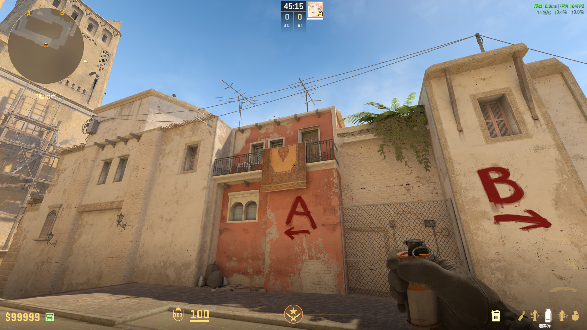

## 中路 — 沙袋补vip烟
**类型**: 烟雾  ·  **阵营**: T

**落点**: vip  
**站位**: 沙袋后中间凹糟  
**描点**:   
**操作**: 蹲着投  
**备注**: 

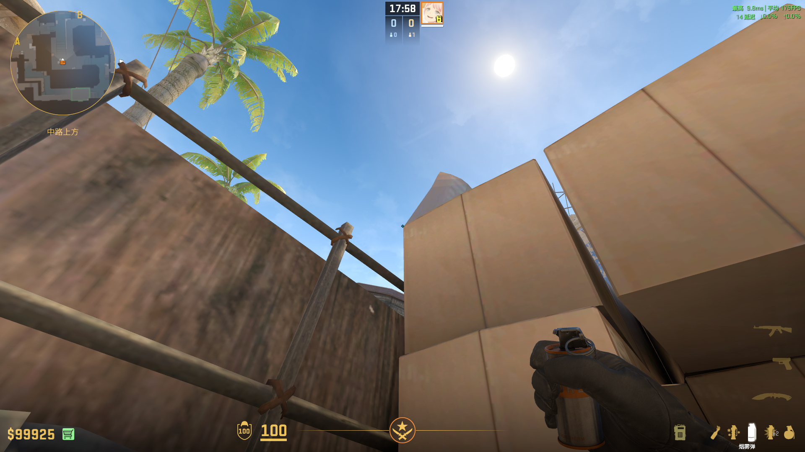

## 中路 — 拱门上烟
**类型**: 烟雾  ·  **阵营**: T

**落点**: 拱门上  
**站位**: 沙袋后左边凹槽  
**描点**:   
**操作**: 左键投  
**备注**: 

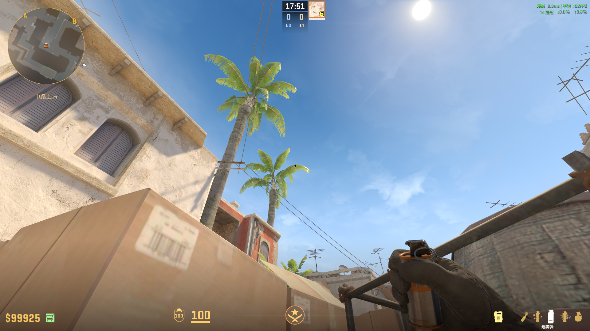

## A — CT烟
**类型**: 烟雾  ·  **阵营**: T

**落点**: CT箱子上  
**站位**: 抵住A1斜着的墙  
**描点**:   
**操作**: 跳投  
**备注**: 

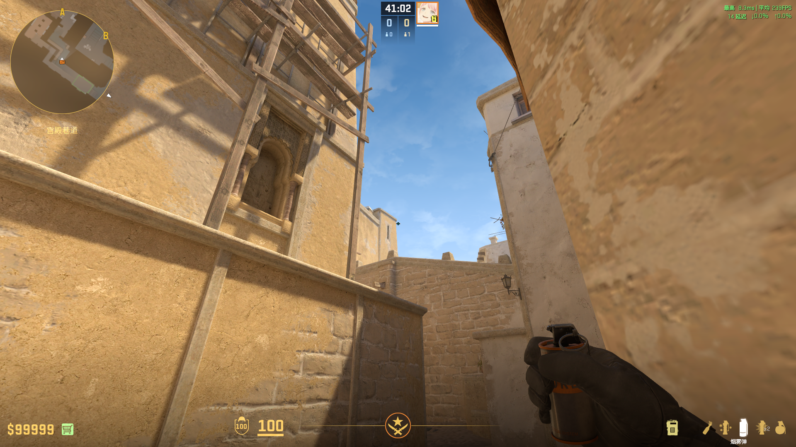

## A — Ttk链接瀑布烟
**类型**: 烟雾  ·  **阵营**: T

**落点**:   
**站位**: 瞄准污渍抵住墙  
**描点**: 对齐灯左上角的污渍  
**操作**: 跳投  
**备注**: BV1pBJ9zREqt

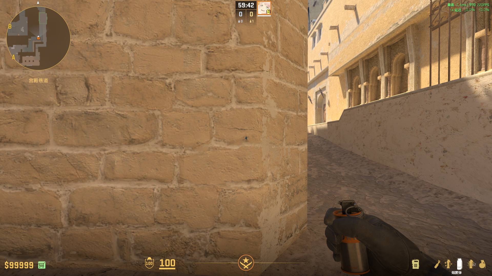
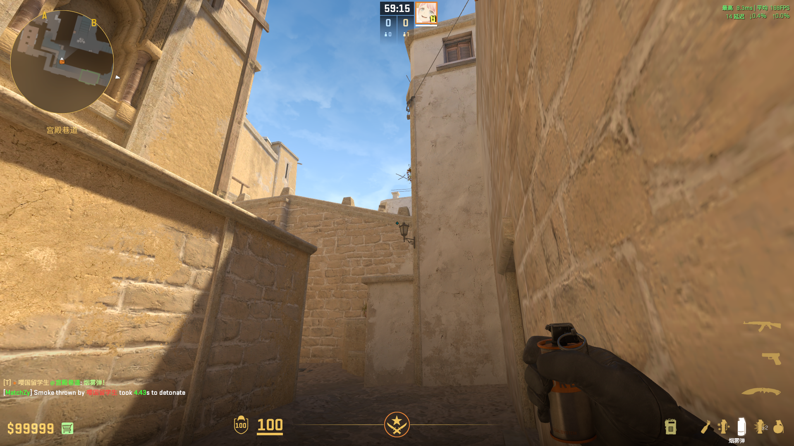

## A — Ttk跳台烟
**类型**: 烟雾  ·  **阵营**: T

**落点**:   
**站位**: 同上  
**描点**: 对齐白色油漆中间的污渍  
**操作**: 向前跑直到准星经过下方木头时跳投  
**备注**: BV1pBJ9zREqt

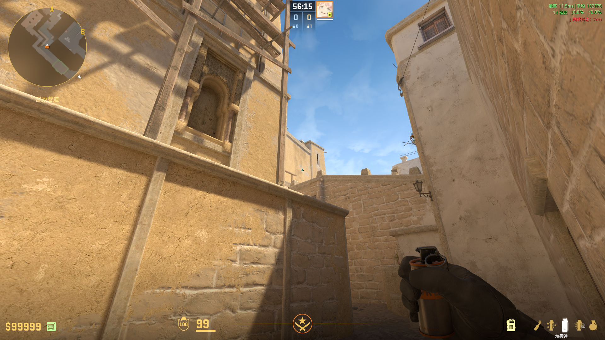

## A — TtkCT烟
**类型**: 烟雾  ·  **阵营**: T

**落点**:   
**站位**: 同上  
**描点**: 对齐白色污渍  
**操作**: 跳投  
**备注**: BV1pBJ9zREqt

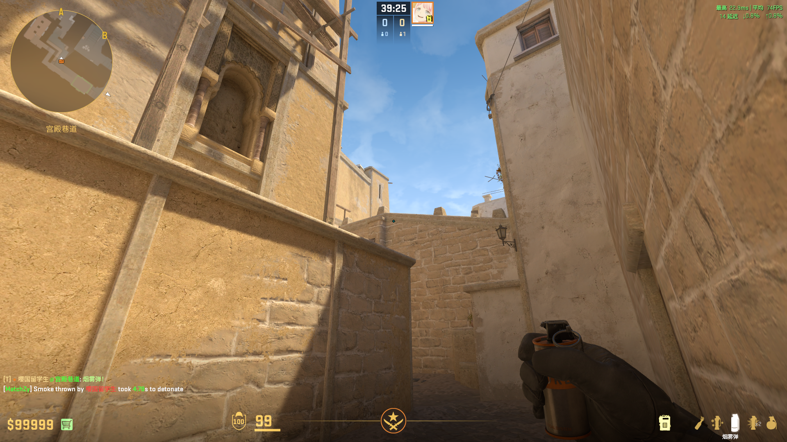

## A — Hooxi链接烟
**类型**: 烟雾  ·  **阵营**: T

**落点**:   
**站位**: 对齐跳台中间木杆  
**描点**: 对齐两块木条中间  
**操作**: 跳投  
**备注**: BV1c8xazVEBA

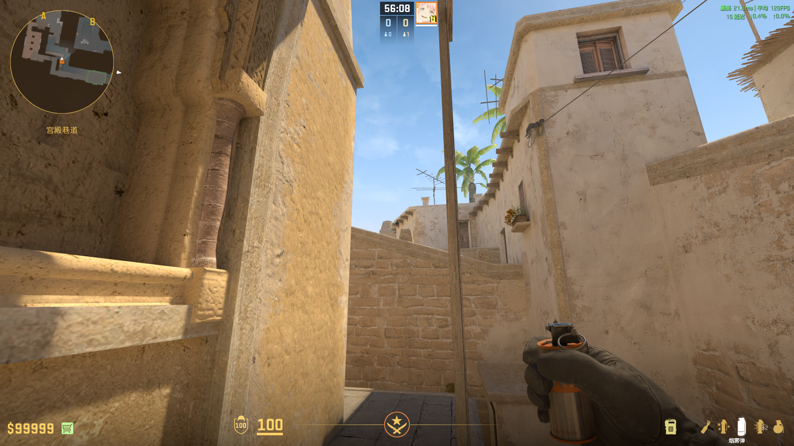

## A — Hooxi跳台火
**类型**: 火  ·  **阵营**: T

**落点**:   
**站位**: 同上  
**描点**:   
**操作**: W跳投  
**备注**: BV1c8xazVEBA

## A二楼 — 上下两烧火
**类型**: 火  ·  **阵营**: T

**落点**:   
**站位**:   
**描点**: 蹲下描  
**操作**: 站起走到A2出口角落左键投  
**备注**: A2被封烟时使用

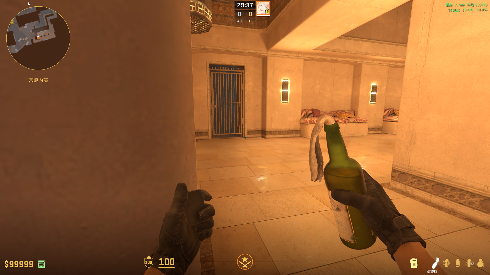
