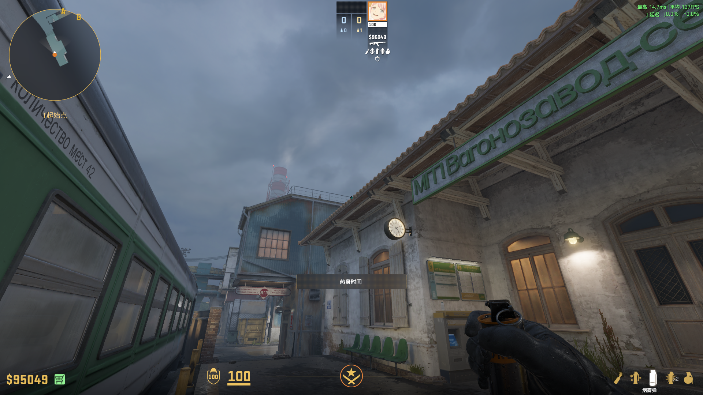
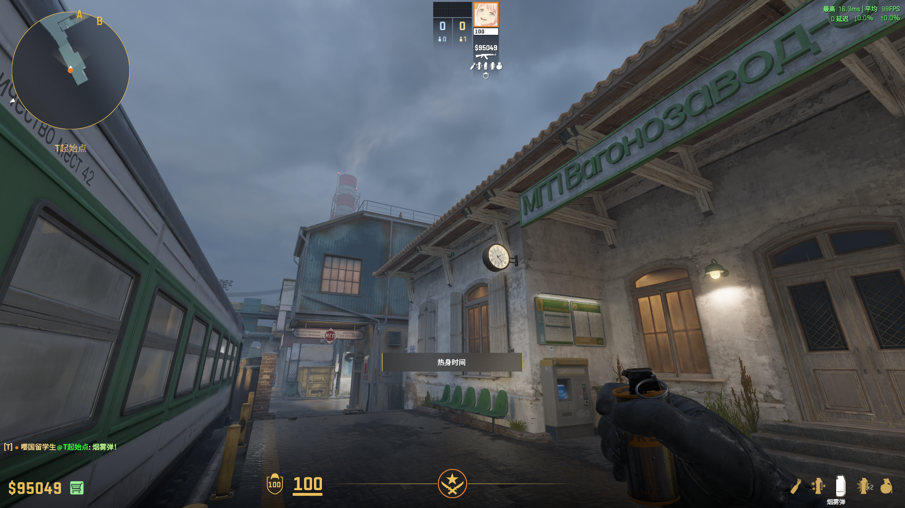
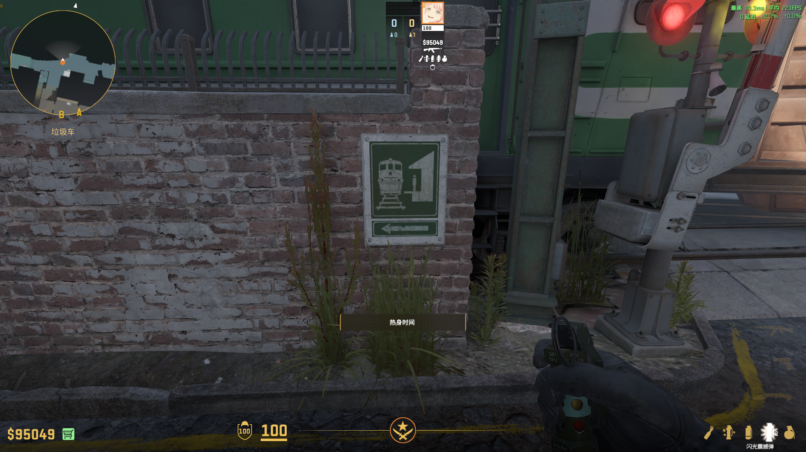
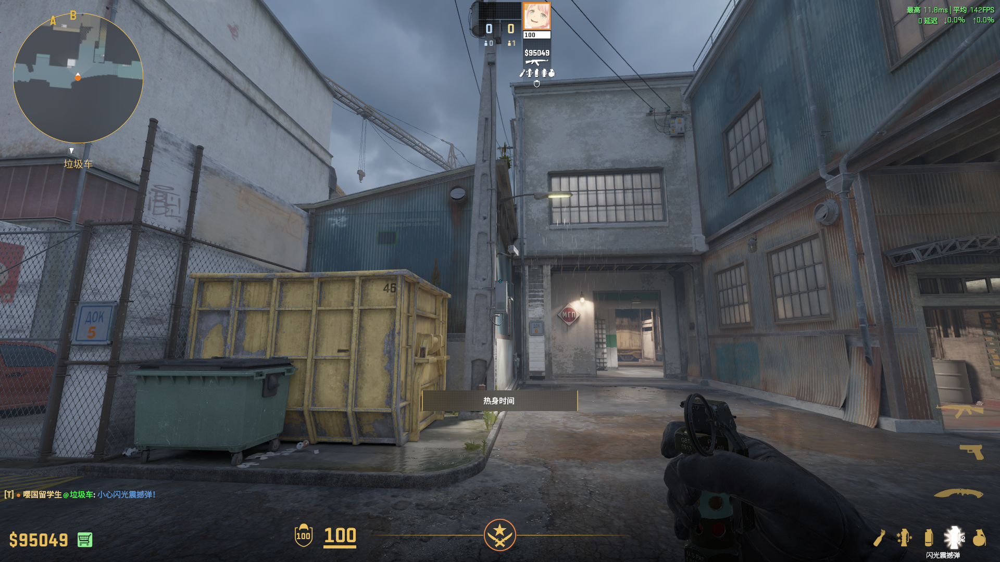
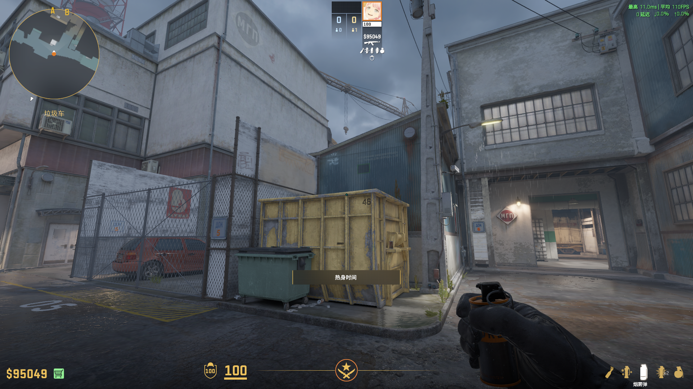
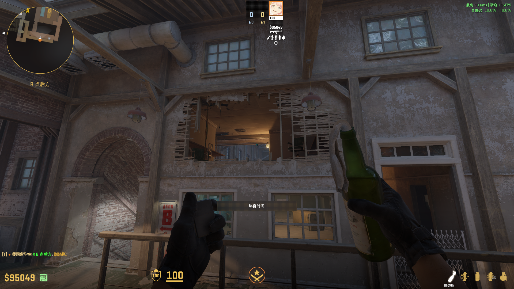
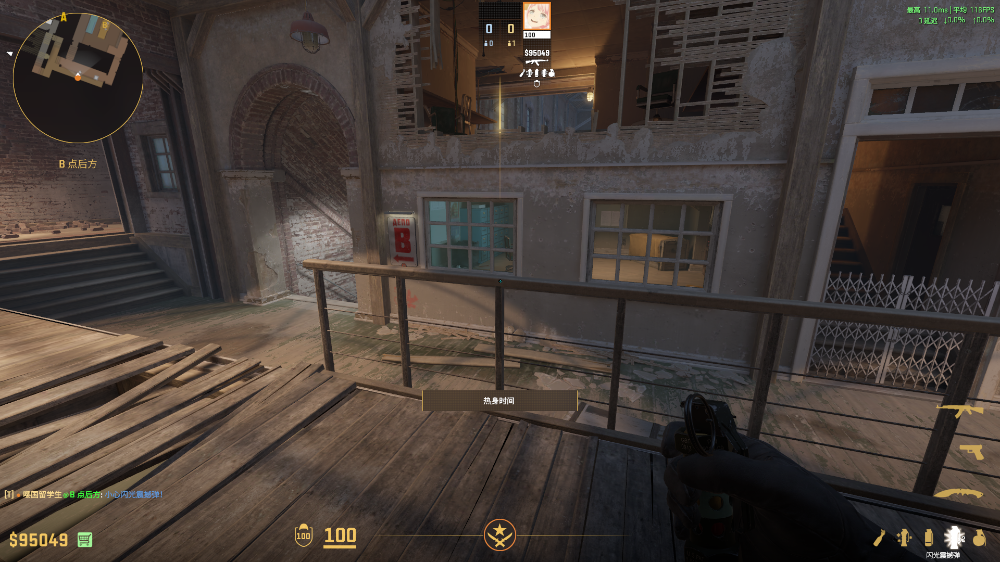
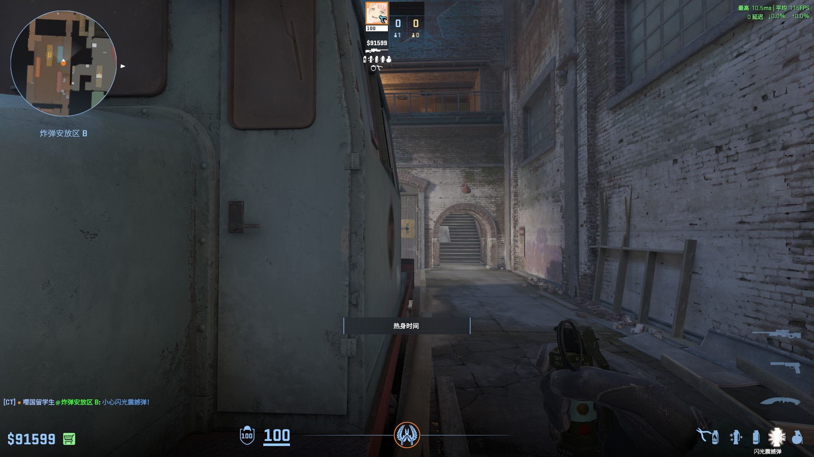
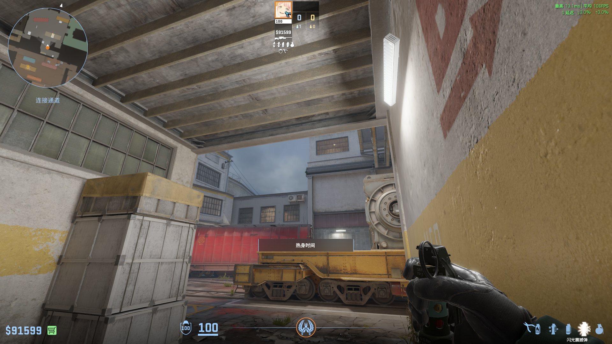
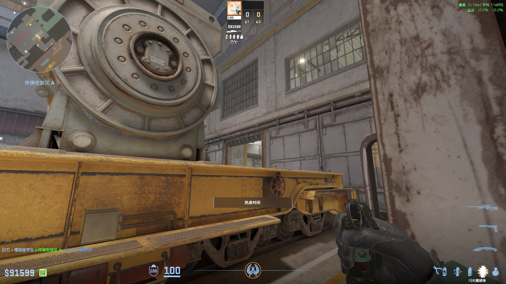

# Train

## 外场 — 三明治烟
**类型**: 烟雾  ·  **阵营**: T

**落点**: 五、六道中  
**站位**:   
**描点**: 对齐栏杆和屋檐交界处  
**操作**: 跳投  
**备注**: 

## 外场 — window烟
**类型**: 烟雾  ·  **阵营**: T

**落点**: window  
**站位**: 同上  
**描点**: 对齐木头尾端右下角  
**操作**: 跑一小步跳投  
**备注**: 动起来立刻跳

## 外场 — 闪光
**类型**: 闪光  ·  **阵营**: T

**落点**:  
**站位**: 对齐标识牌贴墙  
**描点**: 对齐铁箱中间  
**操作**: 跳投  
**备注**: 

## 外场 — 链接烟
**类型**: 烟雾  ·  **阵营**: T

**落点**:  
**站位**: 同上  
**描点**:   
**操作**: 跳投  
**备注**: 

## 内场 — 链接火
**类型**: 烟雾  ·  **阵营**: T

**落点**:  
**站位**: 抵住角落  
**描点**:   
**操作**: 向前跑跳投  
**备注**: 

## 内场 — 闪光
**类型**: 闪光  ·  **阵营**: T

**落点**:  
**站位**: 同上  
**描点**:   
**操作**: 跳投  
**备注**: 

## 二楼 — 闪光
**类型**: 闪光  ·  **阵营**: CT

**落点**:  
**站位**: 三道车位  
**描点**: 对齐3的中间  
**操作**: 跳投  
**备注**: 

## 外场 — 匪口闪
**类型**: 闪光  ·  **阵营**: CT

**落点**:  
**站位**: 链接墙角  
**描点**: 对齐黑条末端  
**操作**: 左键投  
**备注**: 

## 绿通 — 反清闪
**类型**: 闪光  ·  **阵营**: CT

**落点**:  
**站位**: 对齐链接铁门  
**描点**: 对齐window上框中间  
**操作**: 左键投  
**备注**: 

